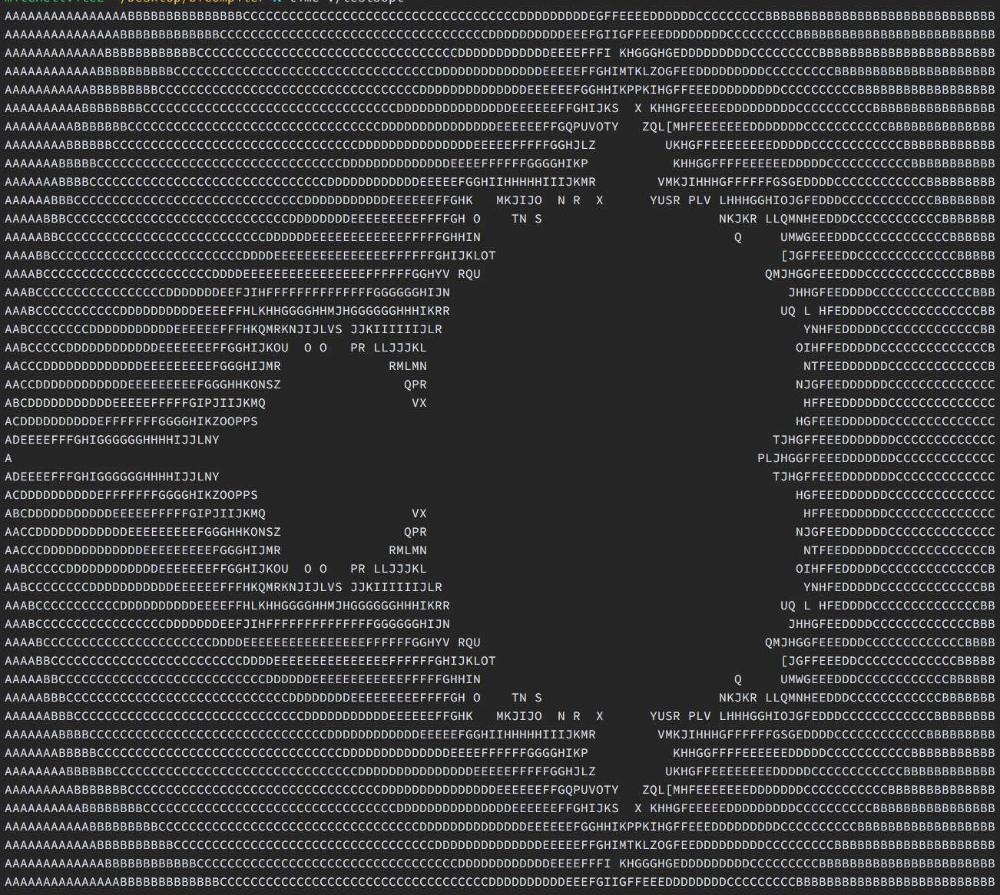

# bfcompiler
++++++++[>++++[>++>+++>+++>+&lt;&lt;&lt;&lt;-]>+>+>->>+[&lt;]&lt;-]>>.>---.+++++++..+++.>>.&lt;-.&lt;.+++.------.--------.>>+.>++.

## About

`bf2c.hs` and `bf2py.hs` are simple one-to-one translators that read each character and output code if code should be generated. C and Python versions exist just to show the simple mechanical nature of this transformation.

`bf2c_opt.hs` is a little more interesting. Here, we actually parse into an AST, so it's easy to perform optimizations. For example, if we have five "move 1 to the right" (`>>>>>`) instructions in a row, we can optimize to a single line of code to "move 5 to the right". We can do this with multiple `+`, `-` or `<` in a row as well.

We also introduce `Clear` and `Copy` nodes to optimize a few common idioms. Copying occurs when we move the contents of one cell to another with a `[->+<]` loop. We can transform the loop from O(n) to O(1) by adding the entire first number to the second in a constant number of instructions. Clear loops look like `[-]`. This just sets the number in a cell to 0, which we can do in one step.

All generated C/Python code is pretty printed with proper indentation, and so should be (relatively) easy to read.

## Usage

Compile the compiler, compile to C, then compile the C.
```
ghc bf2c_opt.hs
./bf2c_opt test.b > test.c
gcc test.c -o test
./test
```

## Results

The output of `test5.b` after compilation and running. This test case was optimized from an 18 second runtime down to 1 second:


